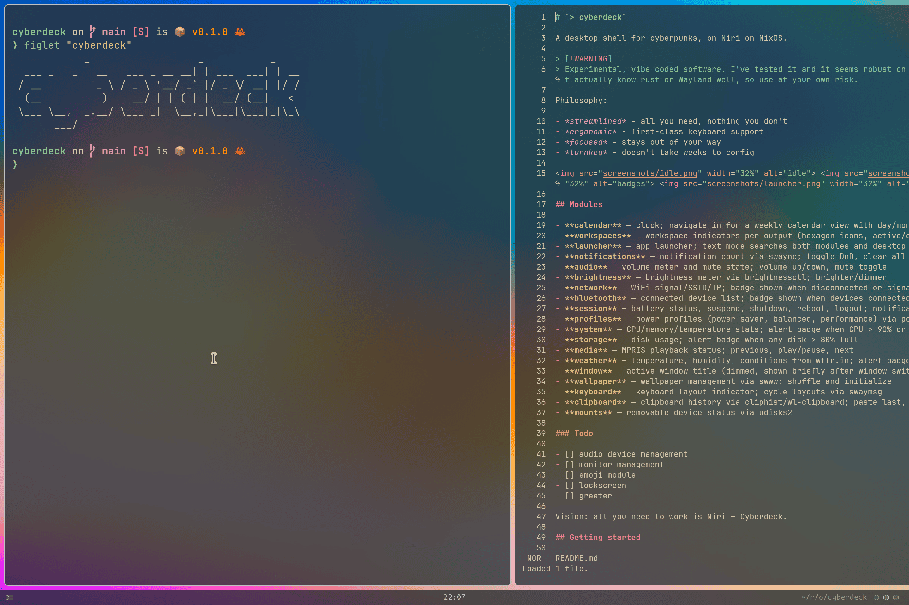
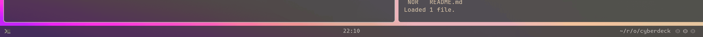
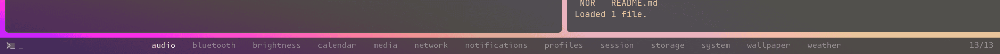
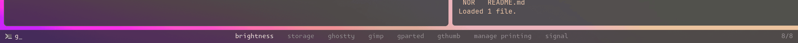

> [!WARNING]  
> Experimental, vibe coded software. Works on my machine, but I'm no Rust/Wayland dev.

# `> cyberdeck`

A desktop shell for cyberpunks, on Niri on NixOS.

Philosophy:

- *streamlined* - all you need, nothing you don't
- *ergonomic* - first-class keyboard support
- *focused* - stays out of your way
- *turnkey* - doesn't take weeks to config



When **idle** the bar tries to show as little clutter as possible:



When **activated** you get a module menu:



This is also a **launcher** and will find apps when you type:



## Modules

- **calendar** — clock; navigate in for a weekly calendar view with day/month/year navigation
- **workspaces** — workspace indicators per output (hexagon icons, active/dim)
- **launcher** — app launcher; text mode searches both modules and desktop applications
- **notifications** — notification count via swaync; toggle DnD, clear all
- **audio** — volume meter and mute state; volume up/down, mute toggle
- **brightness** — brightness meter via brightnessctl; brighter/dimmer
- **network** — WiFi signal/SSID/IP; badge shown when disconnected or signal low
- **bluetooth** — connected device list; badge shown when devices connected
- **session** — battery status, suspend, shutdown, reboot, logout; notifications on low battery
- **profiles** — power profiles (power-saver, balanced, performance) via power-profiles-daemon
- **system** — CPU/memory/temperature stats; alert badge when CPU > 90% or temp > 90C
- **storage** — disk usage; alert badge when any disk > 80% full
- **media** — MPRIS playback status; previous, play/pause, next
- **weather** — temperature, humidity, conditions from wttr.in; alert badge in bad weather
- **window** — active window title (dimmed, shown briefly after window switch)
- **wallpaper** — wallpaper management via swww; shuffle and initialize
- **keyboard** — keyboard layout indicator; cycle layouts via swaymsg
- **clipboard** — clipboard history via cliphist/wl-clipboard; paste last, clear history
- **mounts** — removable device status via udisks2

### Todo

- [ ] audio device management
- [ ] monitor management
- [ ] snip module for screengrabs
- [ ] emoji module
- [ ] lockscreen
- [ ] greeter

Vision: all you need to work is Niri + Cyberdeck.

## Getting started

### Prerequisites

- *NixOS* with flakes enabled
- *Niri* although other Wayland compositors may work

At this point only Niri is officially supported. Any other support would require other contributors.

### Installation

Add cyberdeck to your flake inputs:

```nix
# flake.nix
{
  inputs.cyberdeck.url = "github:ixxie/cyberdeck";
}
```

Import the NixOS module and enable the service:

```nix
# configuration.nix
{ inputs, ... }: {
  imports = [ inputs.cyberdeck.nixosModules.default ];

  services.cyberdeck = {
    enable = true;
    settings = {
      font = "MonaspiceKr Nerd Font";
    };
    mods = {
      calendar.enable = true;
      workspaces.enable = true;
      network.enable = true;
      session.enable = true;
      profiles.enable = true;
      audio.enable = true;
      bluetooth.enable = true;
      brightness.enable = true;
      system.enable = true;
      notifications.enable = true;
      media.enable = true;
      weather.enable = true;
      storage.enable = true;
      launcher.enable = true;
      window.enable = true;
      wallpaper.enable = true;
      keyboard.enable = true;
      clipboard.enable = true;
      mounts.enable = true;
    };
  };
}
```

Rebuild your system and the bar will start automatically.

### Keybinding

Add a toggle keybinding in your compositor config. For niri:

```nix
"Mod+Space".action.spawn = ["cyberdeck" "launcher"];
```

## Configuration

### Settings

```nix
services.cyberdeck.settings = {
  font = "MonaspiceKr Nerd Font";  # any monospace font
  font-size = 14;
  padding = 6;                     # vertical padding
  padding-horizontal = 12;         # horizontal padding (overrides padding for left/right)
  padding-left = 12;               # left padding (overrides padding-horizontal)
  padding-right = 8;               # right padding (overrides padding-horizontal)
  icon-weight = "duotone";         # phosphor icon weight: regular, bold, light, thin, fill, duotone
  position = "top";                # top or bottom
  background = {
    color = "#000000";
    opacity = 0.4;
  };
  output-scales = {                # per-monitor scale multiplier
    "DP-2" = 0.8;
    "eDP-1" = 1.0;
  };
};
```

### Bar layout

The bar config has two parts: `order` (display sequence) and `modules` (definitions):

```nix
services.cyberdeck.extraConfig.bar = {
  order = [
    "notifications"
    "media"
    "system"
    "storage"
    "audio"
    "brightness"
    "bluetooth"
    "weather"
    "network"
    "profiles"
    "session"
    "wallpaper"
    "window"
    "keyboard"
    "clipboard"
    "mounts"
    "calendar"
    "workspaces"
  ];
};
```

The root bar has three fixed sections: left (launcher icon + status badges), center (clock), and right (window title + workspaces). Badges only appear when their condition is met (e.g., audio shows when muted, network shows when signal is low).

### Modules

Each module can define:

- **`icon`** — module icon shown in the breadcrumb when focused
- **`badges`** — named map of badges shown on the root bar (see below)
- **`widget`** — content shown when the module is focused
- **`hooks`** — trigger toasts or badge overrides on state changes
- **`key-hints`** — keyboard shortcuts shown on the right when focused
- **`type`** — set to `"calendar"`, `"bluetooth"`, `"wallpaper"`, or `"actions"` for interactive modules with rich keyboard navigation

### Badge system

Badges are the icons/text shown on the root bar for each module. Each module can define multiple named badges:

```nix
badges = {
  # Always-visible badge (no condition)
  battery = {
    template = "{{ battery_pct }}%";
  };
  # Alert badge (only shown when condition is true)
  low-battery = {
    template = "{{ \"battery-warning\" | icon }} LOW";
    condition = "{{ battery_pct < 20 }}";
    highlight = "{{ \"battery-warning\" | icon }} {{ battery_pct }}%";
  };
};
```

- **Badge** — always visible on the root bar (no `condition`)
- **Alert badge** — only appears when its `condition` template evaluates truthy

Each badge has:
- `template` — Tera template for the badge content
- `condition` (optional) — if present, badge only shows when this renders truthy
- `highlight` (optional) — alternative template used when a hook forces the badge visible
- `icon-scale` (optional) — scale multiplier for icons within this badge

### Hooks

Hooks trigger actions when module state changes:

```nix
hooks = [
  {
    condition = "{{ changed(key=\"muted\") and muted }}";
    action = "show-badge:muted";  # force-show a specific badge
    timeout = 3;
  }
  {
    condition = "{{ changed(key=\"volume\") }}";
    action = "toast";  # show a transient notification
    timeout = 3;
  }
];
```

Hook actions:
- `"toast"` — show a transient message on the left of the bar
- `"show-badge:<badge-name>"` — force-show a specific badge temporarily (overrides condition)
- Any other string — executed as a shell command

### IPC

The bar exposes a Unix socket at `$XDG_RUNTIME_DIR/cyberdeck.sock`. Commands:

```sh
cyberdeck launcher       # toggle the launcher
cyberdeck push <module>  # navigate to a module
cyberdeck run <mod> <key> # run a module's key-hint action
cyberdeck state          # get current navigation state
cyberdeck dismiss        # reset to root
```

Use `cyberdeck run` in compositor keybindings for volume/brightness control with instant feedback.

## Developing

### Source layout

```
src/
  main.rs       — entry point, CLI parsing, event loop
  bar.rs        — Wayland integration, BarApp struct, delegates
  nav.rs        — navigation state machine, input handling
  view.rs       — layout composition, text search
  config.rs     — configuration schema (JSON deserialization)
  source.rs     — data source management (poll, subscribe, file, native)
  template.rs   — Tera template engine, filters, functions
  layout.rs     — flex layout engine, hit area tracking
  render.rs     — text rendering (cosmic-text), icon compositing
  icons.rs      — SVG icon loading (Phosphor icons)
  ipc.rs        — Unix socket IPC protocol
  color.rs      — RGBA color type
  mods/
    mod.rs      — InteractiveModule trait, native source registry
    calendar.rs — clock + calendar navigation
    launcher.rs — desktop application scanner
    wallpaper.rs — wallpaper management via swww
    ...         — audio, bluetooth, system, etc.
```

### Key concepts

- **Module** (`ModuleDef`) — a data source + display configuration. Defined in `bar.modules`.
- **Badge** (`BadgeDef`) — a small status element on the root bar. Each module can have multiple named badges.
- **Widget** (`WidgetDef`) — expanded content shown when a module is focused.
- **InteractiveModule** — trait for modules with rich keyboard-driven navigation (calendar, bluetooth, wallpaper, actions).
- **Source** — how a module gets data: `poll` (periodic command), `subscribe` (streaming), `file` (JSON files), or `native` (Rust implementation).
- **Toast** — transient notification shown on the left of the bar.

### Data flow

1. Sources poll/stream data in background threads
2. JSON updates sent to main thread via calloop channels
3. `process_hooks()` evaluates hook conditions on state changes
4. `maybe_redraw()` renders all bar instances via the template engine
5. Tera templates produce text + icon sequences
6. Flex layout positions three groups (left, center, right)
7. Renderer shapes text (cosmic-text) and composites icons (tiny-skia)
8. Output copied to Wayland shared memory buffer

### Building

```sh
nix build            # build the package
nix develop          # dev shell with cargo, rust-analyzer
cargo check          # type-check without building
```

## License

MIT
